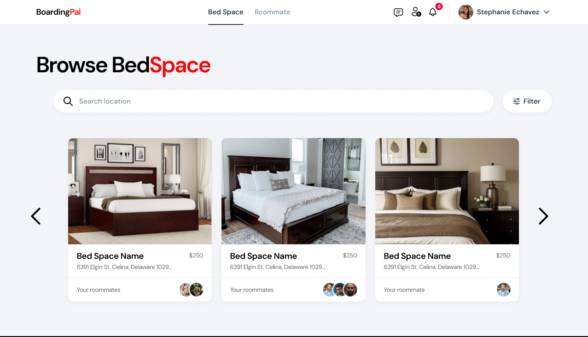
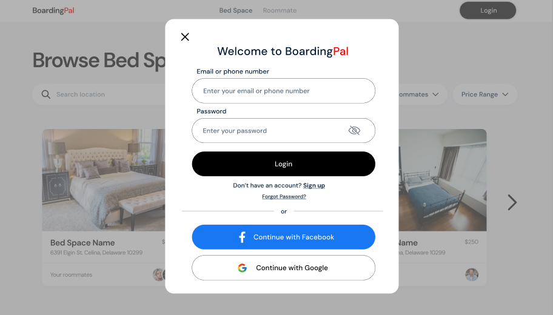
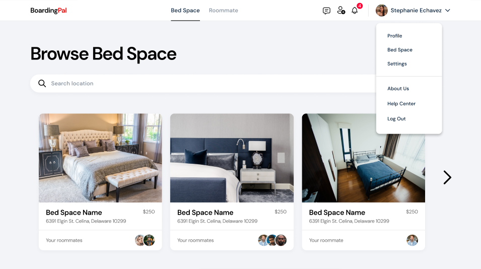
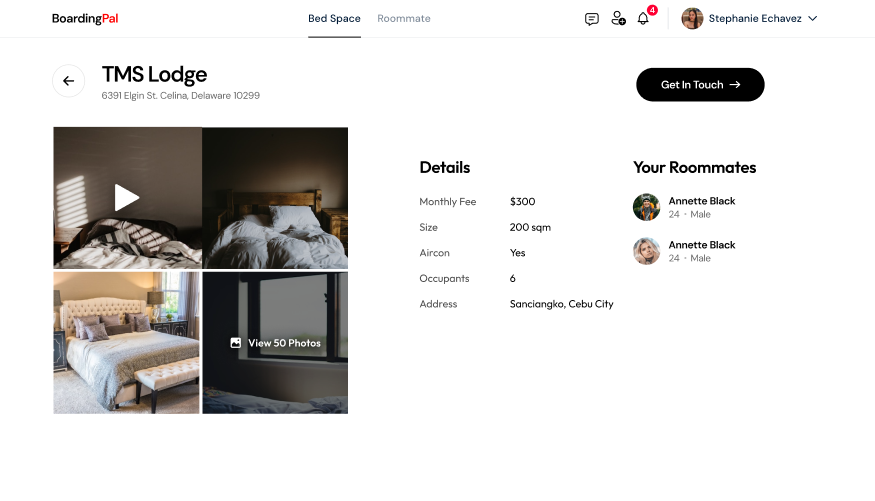
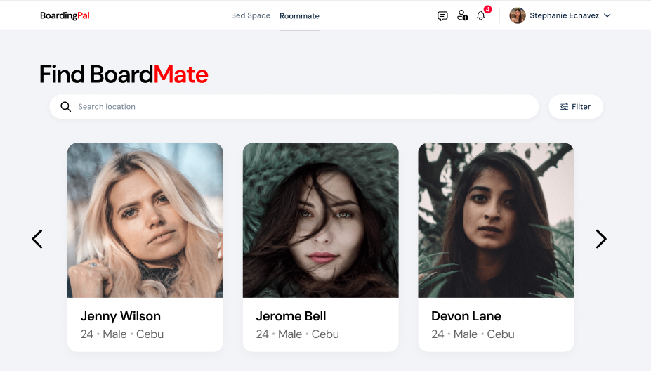
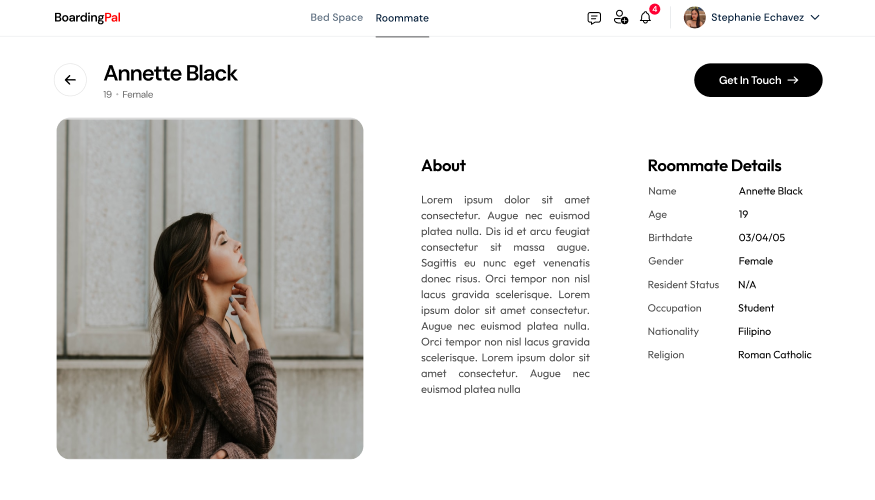
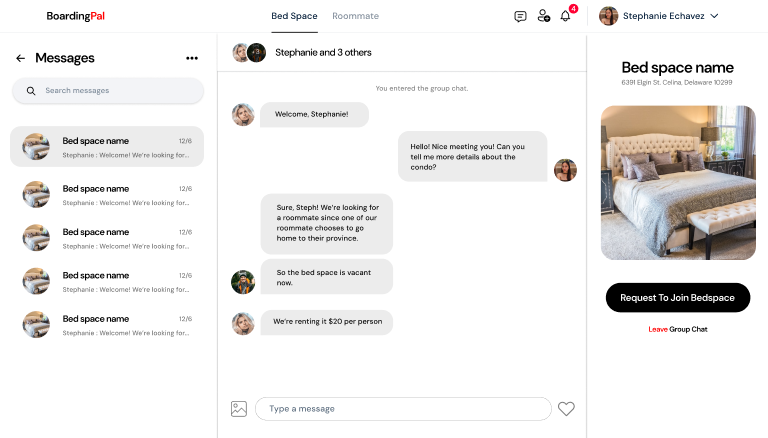
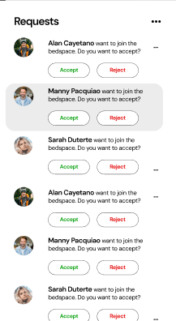

# BoardingPal 🚀

✨ **A Middleman for Boardmates** ✨

---

### Purpose
BoardingPal addresses a common challenge for boarding students and workers: finding a suitable roommate who aligns with their preferences and interests. Sharing a space with boardmates helps reduce rental expenses and creates a more collaborative living experience. 🌟

According to a [study conducted by Central Philippine University, Iloilo City](https://repository.cpu.edu.ph/handle/20.500.12852/1551), there has been a 40% increase in boarding house licenses since the 1990s, highlighting the growing market for boarding accommodations. Unlike traditional apps focused on boarding house listings, BoardingPal bridges the gap between two perspectives:

1. **Current tenants** of boarding house bedspaces looking for compatible roommates.
2. **Individuals seeking** affordable bedspaces with existing roommates.

This app emphasizes boardmate-to-boardmate interaction rather than engaging with business owners. 🤝

---

### Key Features 🚀
- **Profile Customization**: Users can sign up for free and customize their profile, which is visible to others for boardmate compatibility assessment.
- **Personal Bedspace Setup**: Users with a current bedspace can list it, making it visible in the app’s "Browse Bedspaces" section.
- **Find a Boardmate**: Current bedspace owners can browse potential boardmates, view their detailed profiles, and initiate conversations.
- **Browse Bedspaces**: Users searching for bedspaces can explore listed options, view detailed information, and chat with the bedspace owners for negotiations.
- **Chat Functionality**: Users can engage in real-time chat with potential boardmates or bedspace owners to discuss compatibility, negotiate terms, and finalize arrangements. 💬💬💬
- **Request to Join a Bedspace**: Users can send a request to join a listed bedspace. The owner receives the request and can accept or decline.

---

### User Interface:
**Home Page**

**Login**

**Browse Bedspace**

**Bedspace Details**

**Find BoardMate**

**BoardMate Details**

**Chat**

**Requests**


---

### Tech Stack
- **IDE**: NetBeans
- **GUI Components**: Java Swing and AWT
- **Programming Language**: Java (no additional libraries except the essentials) 💻💻💻
- **Design Tools**: Canva and Figma

---

### Contributors 🎉🎉🎉
- **Adriane Dilao**: Group Leader / Lead Programmer
- **John Olasiman**: Assistant / Project Manager
- **Karylle Catubay**: Project Manager
- **Stephanie Echavez**: UI/UX Designer
- **Gil Tabañag**: Frontend Developer
- **Dave Gulay**: Programmer

---

### Installation Steps
1. **Install Requirements**: Download and install NetBeans 23, Java, and JDK version 22.02.
2. **Setup Directory**: Ensure you have a `NetBeansProjects` directory configured.
3. **Clone Repository**: Navigate to your `NetBeansProjects` directory via terminal and run:
   ```bash
   git clone https://github.com/AdrianeDriane/BoardingPal.git
   ```

---

### Acknowledgments
- **Special Thanks**: To Sir Carlson Kim for his valuable feedback and recommendations during development. 🌟🌟🌟
- **Additional Shoutouts**: Ivica Zubac and Domantas Sabonis for coming through with rebounding bets, and McDonald's Iced Coffee for fueling our sleepless nights. ☕☕☕

---

